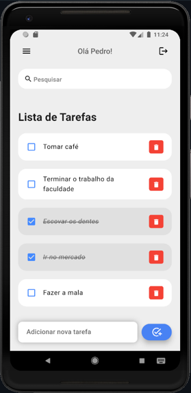

# ToDo List




> Este projeto é um aplicativo de lista de tarefas desenvolvido utilizando o framework Flutter e a linguagem Dart. Os usuários têm a capacidade de criar e gerenciar várias listas de afazeres de forma personalizada, permitindo uma organização eficaz de suas tarefas diárias.
## 🔧 Tecnologias Utilizadas

No projeto, a principal tecnologia adotada foi o Flutter, utilizando a linguagem de programação Dart.


## 💻 Pré-requisitos

Antes de começar, verifique se você atende aos seguintes requisitos:

- Você tem uma máquina com o Flutter SDK instalado
- Você tem um editor de código compatível com o Flutter, como o Visual Studio Code ou o Android Studio
- Você tem um dispositivo físico com USB disponível ou um emulador configurado para executar a aplicação

## 🚀 Instalando o App
Para instalar o aplicativo de ToDo List, siga estas etapas:

- Clone este repositório para o seu ambiente local
- Abra o projeto no seu editor de código
- Conecte um dispositivo físico via USB ou utilize um emulador
- Execute o arquivo **"main.dart"** para iniciar a aplicação no dispositivo selecionado.

Após abrir o projeto na sua IDE, execute os seguintes comandos no terminal do projeto:
```
flutter clean
flutter packages get
```

## 🤝 Colaboradores

Agradecemos às seguintes pessoas que contribuíram para este projeto:

<table>
  <tr>
    <td align="center">
      <a href="https://github.com/pbgollo" title="Perfil do Pedro Gollo no GitHub">
        <br>
        <sub>
          <b>Pedro Gollo</b>
        </sub>
      </a>
    </td>
    <td align="center">
      <a href="https://github.com//pedrin-pedrada" title="Perfil do Pedro Schneider no GitHub">
        <br>
        <sub>
          <b>Pedro Schneider</b>
        </sub>
      </a>
    </td>
    <td align="center">
      <a href="https://github.com/viezzer" title="Perfil do Eduardo Viezzer no GitHub">
        <br>
        <sub>
          <b>Eduardo Viezzer</b>
        </sub>
      </a>
    </td>
    <td align="center">
      <a href="https://github.com/surviveed" title="Perfil do Francisco no GitHub">
        <br>
        <sub>
          <b>Francisco</b>
        </sub>
      </a>
    </td>
  </tr>
</table>
